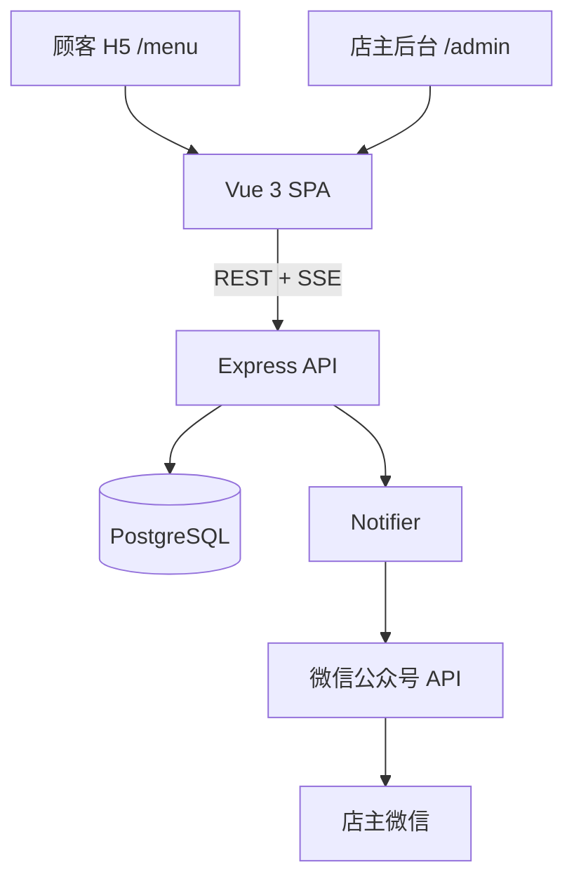

# 02 架构与目录结构

## 2.1 技术选型

| 模块 | 技术 |
| --- | --- |
| 后端 | Node.js 20 + Express 4 + TypeScript |
| ORM | Prisma 5 |
| 数据库 | PostgreSQL 16 |
| 实时 | SSE（`/api/admin/events/orders`） |
| 鉴权 | JWT（`jsonwebtoken`） |
| 前端 | Vue 3 + Vue Router + Pinia |
| UI（顾客） | Vant 4 + TailwindCSS |
| UI（后台） | Element Plus |
| 构建 | Vite 5 |
| 包管理 | pnpm 9 workspaces |
| 部署 | Docker Compose + Nginx |

## 2.2 总体架构



## 2.3 仓库目录

```text
MealPing/
├── apps/
│   ├── server/                  # 后端 (Express + Prisma)
│   │   ├── prisma/
│   │   │   ├── schema.prisma
│   │   │   └── seed.ts
│   │   └── src/
│   │       ├── config/env.ts
│   │       ├── db/prisma.ts
│   │       ├── middleware/{auth.ts,error.ts}
│   │       ├── modules/
│   │       │   ├── admin/admin.routes.ts
│   │       │   ├── menu/{menu.routes.ts,menu.service.ts,menu.schema.ts}
│   │       │   ├── order/{order.routes.ts,order.service.ts,order.schema.ts,order.events.ts}
│   │       │   └── notify/{notify.routes.ts,notify.service.ts,wechat.client.ts}
│   │       ├── utils/{errors.ts,orderNo.ts}
│   │       ├── app.ts
│   │       └── main.ts
│   └── web/                     # 前端 (Vue 3 单 SPA)
│       └── src/
│           ├── api/             # 按模块拆分的 axios 封装
│           ├── components/{menu,common}
│           ├── layouts/AdminLayout.vue
│           ├── pages/
│           │   ├── menu/{MenuPage.vue,OrderSuccessPage.vue}
│           │   └── admin/{AdminLoginPage.vue,OrderListPage.vue,MenuManagePage.vue,NotifyLogPage.vue}
│           ├── router/index.ts
│           ├── stores/cart.ts
│           ├── styles/main.css
│           ├── App.vue
│           └── main.ts
├── packages/
│   └── shared/                  # 前后端共享类型 / 常量 / 工具
│       └── src/{constants.ts,money.ts,types.ts,index.ts}
├── docs/                        # 本目录
├── docker-compose.yml
├── pnpm-workspace.yaml
└── .env.example
```

## 2.4 模块职责

- **`apps/server/src/modules/*`**：每个模块自包含 `routes`（HTTP 入口）、`service`（业务逻辑）、`schema`（Zod 校验）。
- **`packages/shared`**：仅放纯 TypeScript 类型与常量，不依赖运行时框架，前后端都能直接引用。
- **`apps/web/src/api`**：浏览器侧封装，统一基于单一 `http` 实例（自动注入 admin token、统一处理 401）。
