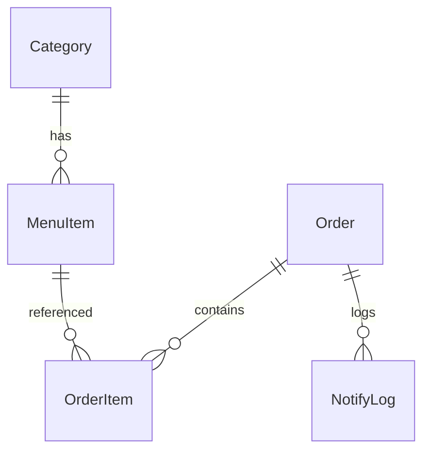

# 03 数据模型

数据库：**PostgreSQL 16**，通过 Prisma 5 管理。

Schema 文件：`apps/server/prisma/schema.prisma`

## 3.1 ER 概览



## 3.2 表说明

### `categories`（菜品分类）

| 字段 | 类型 | 说明 |
| --- | --- | --- |
| id | int PK | 自增 |
| name | string | 分类名称 |
| sortOrder | int | 排序值，升序 |
| status | string | `active` / `inactive` |
| createdAt / updatedAt | timestamp | |

### `menu_items`（菜品）

| 字段 | 说明 |
| --- | --- |
| id | PK |
| categoryId | 外键 → categories.id |
| name / description | 名称与描述 |
| **price** | 整型，单位 **分** |
| imageUrl | 图片 URL（可空） |
| status | `active` / `inactive` |
| sortOrder | 排序值 |

> 价格使用整型分存储以避免浮点误差；前端展示时用 `centsToYuan`。

### `orders`（订单）

| 字段 | 说明 |
| --- | --- |
| id | PK |
| **orderNo** | 唯一订单号，例如 `20260510-ABC123` |
| tableNo | 桌号（可空） |
| remark | 备注（可空） |
| totalAmount | 总金额，单位分 |
| status | `pending` / `preparing` / `completed` / `canceled` |
| notifyStatus | `pending` / `sent` / `failed` / `disabled` |
| createdAt / updatedAt | |

### `order_items`（订单明细）

| 字段 | 说明 |
| --- | --- |
| orderId | 外键 → orders.id（cascade） |
| menuItemId | 外键 → menu_items.id（restrict） |
| **name / unitPrice** | 下单时的快照，避免后续菜单改价影响历史订单 |
| quantity | 数量 |
| subtotal | unitPrice * quantity |

### `notify_logs`（通知日志）

| 字段 | 说明 |
| --- | --- |
| orderId | 外键 |
| channel | `wechat_test_account` 等 |
| status | `sent` / `failed` |
| request / response | JSON 字符串 |
| errorMsg | 失败原因 |

## 3.3 状态流转

```text
pending ──▶ preparing ──▶ completed
   │            │
   ▼            ▼
canceled    canceled
```

`canTransition()`（在 `packages/shared/src/constants.ts`）是唯一可信的状态机来源，前后端共用。

## 3.4 迁移管理

- 开发：`pnpm db:migrate`（生成 + 应用 migration）
- 生产：容器启动时执行 `npx prisma migrate deploy`（见 `apps/server/Dockerfile`）
- 重置：`pnpm --filter @mealping/server prisma migrate reset`
