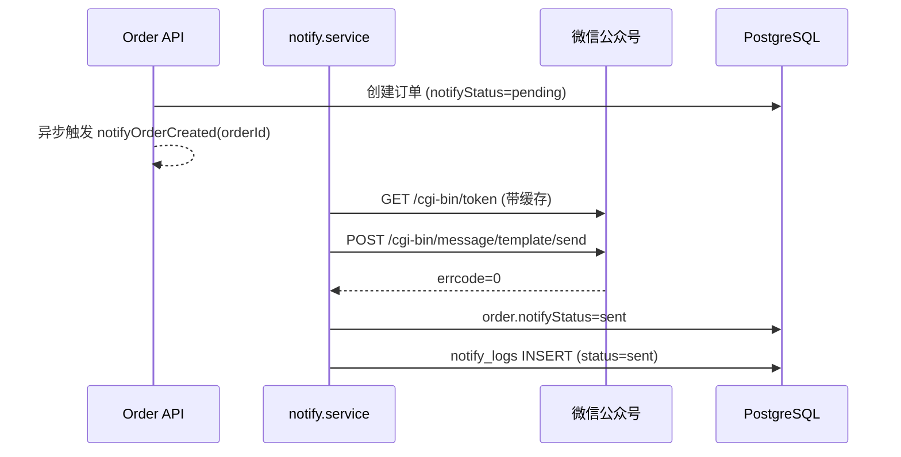

# 06 微信公众号通知接入

当前仅支持 **微信公众号测试号模板消息**（`NOTIFY_CHANNEL=wechat_test_account`）。
代码位置：`apps/server/src/modules/notify/`。

## 6.1 申请测试号

1. 访问 <https://mp.weixin.qq.com/debug/cgi-bin/sandbox?t=sandbox/login>
2. 微信扫码登录后，记下 `appID` / `appsecret`
3. 用微信关注页面下方的二维码（用于接收通知的店主必须关注）
4. 在 **测试号管理 → 用户列表** 中查看该用户的 `OpenID`

## 6.2 添加模板

在 **模板消息接口 → 新增测试模板**，标题随意，例如 `新订单提醒`，内容：

```
{{first.DATA}}
桌号：{{keyword1.DATA}}
菜品：{{keyword2.DATA}}
金额：{{keyword3.DATA}}
时间：{{keyword4.DATA}}
{{remark.DATA}}
```

保存后会得到一个 `templateId`。

## 6.3 配置 .env

```env
NOTIFY_CHANNEL=wechat_test_account
WECHAT_APP_ID=wx......
WECHAT_APP_SECRET=......
WECHAT_TEMPLATE_ID=......
WECHAT_ADMIN_OPENID=......
```

重启服务后，下一笔新订单创建时即会推送。

## 6.4 工作流程



失败路径：

- access_token 拉取异常 / errcode != 0 / 配置缺失 → `notifyStatus=failed`
- 同时写入 `notify_logs.status=failed` + `errorMsg`
- **永远不会**让订单创建失败

## 6.5 排查

- `/admin/notify` 页面可查看最近 100 条日志
- `errorMsg` 常见值：
  - `WeChat AppID / AppSecret 未配置` → 检查 `.env`
  - `errcode=40037` → templateId 不正确
  - `errcode=40003` → openid 错误（未关注测试号）
  - `errcode=42001` → access_token 失效，等待自动刷新即可

## 6.6 后续扩展

- 支持企业微信群机器人（webhook，无需 access_token）
- 支持 Server 酱 / PushPlus（最简单）
- 支持后台手动重发失败通知（按钮 → `POST /admin/notify/retry/:logId`）
